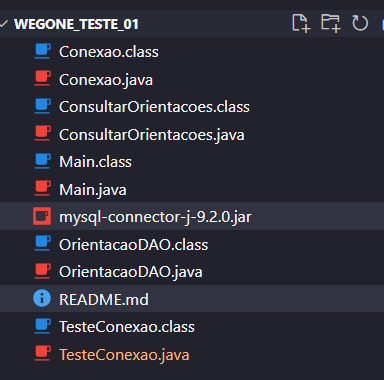

## WegOne_teste_01
Projeto simplificado para JAVA

## 🛠️ WegOne Orientações — CRUD Java + MySQL
Este projeto Java demonstra como fazer conexão com um banco de dados MySQL e realizar operações básicas (consultar, inserir, atualizar, deletar) usando JDBC.

WegOne_teste_01/
│
├── Conexao.java              # Classe de conexão com o banco de dados
├── Orientacao.java           # Classe modelo da entidade Orientacao
├── OrientacaoDAO.java        # Classe com métodos de acesso ao banco (DAO)
├── Main.java                 # Classe principal (menu CRUD via terminal)
├── mysql-connector-j-9.2.0.jar   # Driver JDBC do MySQL
└── README.md

*ConsultaOrientacao.class 

## Teste de conexão com o banco de dados

>> javac -cp ".;mysql-connector-j-9.2.0.jar" TesteConexao.java Conexao.java
>> java -cp ".;mysql-connector-j-9.2.0.jar" TesteConexao

## 💾 Requisitos
- Java JDK 8 ou superior

- MySQL instalado

- Driver JDBC do MySQL: [Baixar aqui](https://dev.mysql.com/downloads/connector/j/)--> extraia e copie o arquivo [mysql-connector-j-9.2.0] para o diretório do seu projeto(no exemplo: WegOne_teste_01)

- Um terminal (CMD, PowerShell, Bash...)

## 🧱 1. Criação do Banco de Dados
Abra o MySQL e execute:
CREATE DATABASE wegone_db;
USE wegone_db;

CREATE TABLE orientacoes (
    id INT AUTO_INCREMENT PRIMARY KEY,
    titulo VARCHAR(255),
    tipo VARCHAR(100),
    conteudo_pt TEXT,
    conteudo_en TEXT,
    conteudo_de TEXT
);

## 📥 2. Coloque o Driver JDBC na Pasta do Projeto
Baixe o mysql-connector-j-9.2.0.jar e coloque dentro da pasta do seu projeto. ex: WegOne_teste_01.

## ⚙️ 3. Compilação via Terminal
Abra o terminal na pasta do projeto:

>> cd C:\Users\seuusuario\Documents\GitHub\WegOne_teste_01

## 🚀 4. Execução via Terminal
>> javac -cp ".;mysql-connector-j-9.2.0.jar" Main.java OrientacaoDAO.java Conexao.java
>> java -cp ".;mysql-connector-j-9.2.0.jar" Main

## 🧪 Funcionalidades Disponíveis
✅ Listar orientações

✅ Inserir nova orientação

✅ Atualizar orientação existente

✅ Remover orientação por ID

## 🧠 Extras
A classe Main traz um menu simples interativo via terminal.

A classe OrientacaoDAO contém os métodos para manipular o banco de dados.

A conexão está em Conexao.java, que pode ser adaptada para usar variáveis de ambiente.

## 🧑‍💻 Exemplo de uso
=== Menu ===
1. Listar orientações
2. Inserir orientação
3. Atualizar orientação
4. Remover orientação
0. Sair